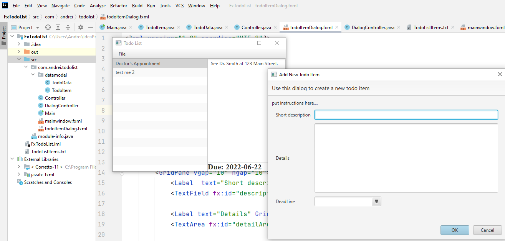

# 15-FxTodoList
JavaFX Learning Project.
Create and manage a Todo list:
  - view Todo list details,
  - add Todo item,
  - delete Todo item.
 
Project structure:  
TodoItem : item class with short description, details and deadline.
TodoData : singleton class that work with the list of items(load, save, add, delete)
Main Class 
  - init() -load the list from file;
  - start() default ; 
  - stop() -save the list to file  .
 
Fxml two files mainwindow.fxml, todoItemDialog.fxml: handle the app view main window and add new Item window;
Controller and DialogController handle app business logic.

 

Steps to create:
  - InteliJ New Project JavaFX Application;
  - add javaFx lib (maven autoimport);
  - add module-info.java;
  - rename sample package, sample.fxml(to mainwindow.fxml) ,   edit title and dimensions in Main,
  - to run with InteliJ modify package name in run button ;
  - create datamodel package: TodoItem class; TodoData class;
  - edit Main class : add init() and stop() methods;
  - edit mainwindow.fxml
  - ...

The app use a .txt file to sava and load data. 

TodoData class is a Singleton:  only one instance of the class is created on the entire run of the application. The Singleton class crate the one instance of itself. Have a private constructor. Contains a static method that allow any classes to get the single instance and to call it’s methods.

  
    
[BACK TO START PAGE](https://github.com/FlorescuAndrei/Start.git)

